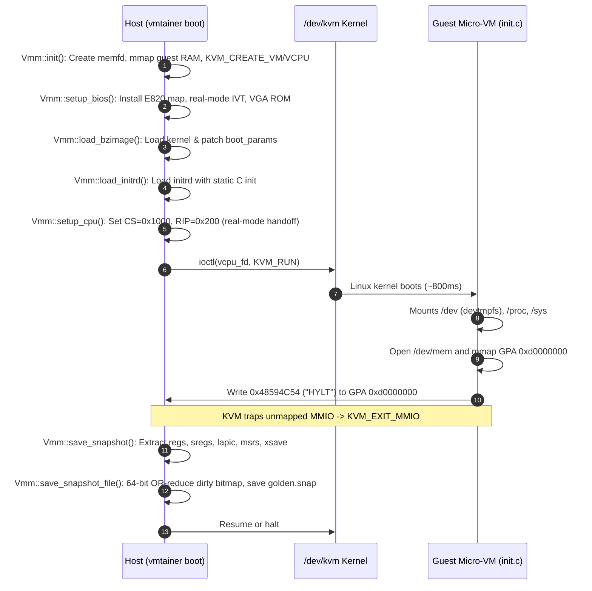
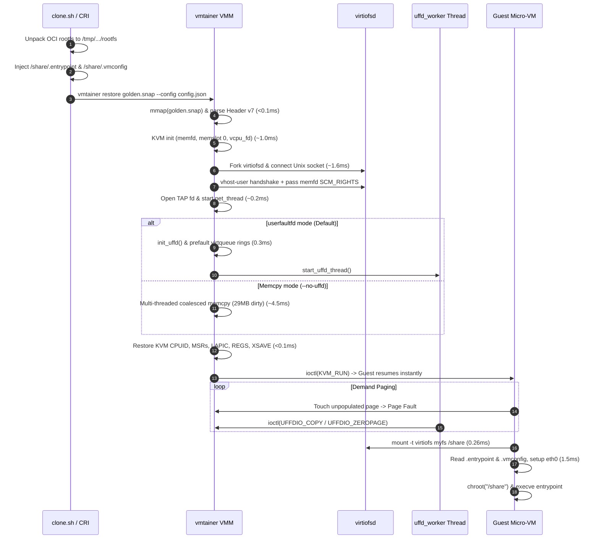

<!--
Copyright (c) 2026 Samir Das <samiruor@gmail.com>. All rights reserved.

PROPRIETARY AND CONFIDENTIAL.
Unauthorized copying, reproduction, distribution, or modification of this
file, via any medium, is strictly prohibited.
All rights reserved.
-->

# vmtainer: Code Organization, Architectural Flow, and Subsystem Reference

This document provides a comprehensive technical overview of **vmtainer**, an ultra-low-latency KVM-based micro-VM container runtime capable of sub-13ms cold-starts from snapshot restore. It details the project's source code hierarchy, lifecycle execution flows, and critical implementation sections.

---

## 1. Code Organization & Directory Structure

The repository is structured into modular layers spanning userspace host virtualization, guest kernel and userland binaries, host kernel acceleration modules, container orchestration shims, and benchmark suites.

```
vmtainer/
├── src/                         # VMM Core Implementation (Modern C++17)
│   ├── vmm.hpp                  # VMM class, snapshot layout, memory & device structures
│   ├── vmm.cpp                  # KVM lifecycle, memory mapping, snapshot engine, CLI entrypoint
│   ├── virtio.hpp               # Virtio MMIO, split virtqueue, vhost-user & vhost-net definitions
│   ├── virtio.cpp               # virtiofsd vhost-user transport, virtio-net userspace bridge
│   ├── boot.hpp                 # Linux x86 boot protocol, real-mode IVT, E820 map definitions
│   ├── bios_rom.h               # Custom real-mode BIOS ROM bytecode
│   ├── bios.bin                 # Compiled binary of minimal BIOS
│   └── bios_offsets.h           # Offsets for BIOS interrupt entrypoints (int 0x10, int 0x15)
│
├── initrd_src/                  # Micro-VM Guest Rootfs & PID 1 Init (C)
│   └── init.c                   # Static C guest init binary (snapshot trigger, mount, network, chroot)
│
├── kmod/                        # Host Kernel Acceleration Module (C / Linux 6.10)
│   ├── vmtainer_snap.c          # Character device (/dev/vmtainer_snap) for pinned vmalloc snapshot cache
│   ├── vmtainer_snap.h          # IOCTL definitions (VMTAINER_SNAP_ALLOC, VMTAINER_SNAP_INFO)
│   ├── snap_bench.c             # Benchmark harness for kernel-pinned memory mapping
│   ├── Makefile                 # Kbuild module Makefile
│   └── test.sh                  # Validation script for the kernel module
│
├── cri/                         # Kubernetes Container Runtime Interface (Go)
│   ├── cmd/
│   │   └── vmtainer-cri/
│   │       └── main.go          # CRI daemon entrypoint (gRPC server, CLI flags, signal handling)
│   ├── pkg/
│   │   ├── runtime/
│   │   │   ├── runtime.go       # CRI v1 RuntimeService implementation (Pod sandbox & container lifecycle)
│   │   │   ├── image.go         # CRI v1 ImageService implementation (OCI image pull, unpack, caching)
│   │   │   └── streaming.go     # HTTP streaming server for exec, attach, and port-forwarding
│   │   ├── vmm/
│   │   │   └── vmm.go           # Process supervisor for spawning and monitoring the vmtainer binary
│   │   ├── network/
│   │   │   ├── cni.go           # CNI plugin integration and TAP device IP management
│   │   │   └── ipam.go          # Subnet IP allocation manager
│   │   └── store/
│   │       └── store.go         # File-backed atomic state persistence for sandboxes and containers
│   ├── go.mod                   # Go module definition
│   └── Dockerfile               # Packaging for running the CRI shim in containerized environments
│
├── docs/                        # Hypervisor & KVM Technical Documentation
│   ├── 01_overview.md           # VMM architecture & KVM basics
│   ├── 02_kvm_basics.md         # ioctl API, memory slots, and vCPU loop
│   ├── 03_vm_exits.md           # Handling VM exits (IO, MMIO, HLT, SHUTDOWN)
│   ├── 04_io_device_simulation.md # PIO/MMIO device emulation mechanics
│   ├── 05_lapic_and_multivcpu.md # Local APIC and multi-processor fundamentals
│   ├── 06_vfio.md               # Direct device assignment
│   ├── 07_acpi_and_bios.md      # Firmware, ACPI tables, and real-mode handoff
│   ├── 08_kernel_loading.md     # Linux bzImage 16/32/64-bit setup code and boot protocol
│   ├── 09_bximage_and_images.md # Virtual disk formats and images
│   └── 10_interrupt_injection.md# KVM IRQ injection mechanics
│
├── scripts/                     # Toolchain, Orchestration & Benchmarking Harnesses
│   ├── build_vmm.sh             # Compiles VMM using g++ with -O3 optimizations
│   ├── build_kernel.sh          # Builds minimal Linux 6.10 guest kernel
│   ├── build_initrd.sh          # Compiles init.c statically with musl/gcc and packs cpio.gz
│   ├── clone.sh                 # End-to-end CLI workflow (pulls OCI image, creates config, restores VM)
│   ├── bench_memory_approaches.sh# Automated benchmark comparing Lazy UFFD, Midway UFFD, and Native Copy
│   ├── bench_parallel_clones.sh # Benchmark measuring 1 to 1000 concurrent VM restorations
│   ├── bench_e2e.sh             # End-to-end latency measurement to container exit
│   ├── bench_restore_only.sh    # VMM restoration latency benchmark
│   ├── setup_hugepages.sh       # Host hugetlbfs allocation script
│   └── mem_bench.c              # Guest micro-benchmark measuring write bandwidth across memory pages
│
├── images/                      # Pre-built Artifacts & Golden Snapshot
│   ├── bzImage                  # Compressed Linux 6.10 kernel image
│   ├── initrd.cpio.gz           # Guest rootfs containing compiled static init
│   └── golden.snap              # Base deterministic snapshot blob (~65MB)
│
└── test_rootfs/                 # Verification container rootfs tree
    └── bin/
        └── mem_bench.c          # Guest source code for memory allocation micro-benchmark
```

### Module Distribution & Lines of Code

| Subsystem | Primary Language | Location | Key Role |
| :--- | :--- | :--- | :--- |
| **VMM Core** | C++17 | [src/vmm.cpp](file:///home/sadas/workspace/vmtainer/src/vmm.cpp), [src/virtio.cpp](file:///home/sadas/workspace/vmtainer/src/virtio.cpp) | Direct KVM control, MMIO virtio, userfaultfd lazy restore, TAP network |
| **Guest Init** | C (Static) | [initrd_src/init.c](file:///home/sadas/workspace/vmtainer/initrd_src/init.c) | In-process syscall boot, virtiofs mount, IP setup, chroot, entrypoint exec |
| **CRI Plugin** | Go 1.22+ | [cri/cmd/](file:///home/sadas/workspace/vmtainer/cri/cmd/), [cri/pkg/](file:///home/sadas/workspace/vmtainer/cri/pkg/) | Kubernetes CRI v1 gRPC server, OCI layer unpacking, sandbox management |
| **Kernel Module** | C (Linux Kbuild) | [kmod/vmtainer_snap.c](file:///home/sadas/workspace/vmtainer/kmod/vmtainer_snap.c) | Zero-fault unevictable snapshot cache via `vmalloc_user()` |
| **Automation** | Bash | [scripts/clone.sh](file:///home/sadas/workspace/vmtainer/scripts/clone.sh), [scripts/bench_*.sh](file:///home/sadas/workspace/vmtainer/scripts/) | OCI image extraction, lifecycle benchmarks, hugepage configuration |

---

## 2. High-Level Architectural Flow

```
                      +-------------------------------------------------------+
                      |         Kubernetes Kubelet / CLI (clone.sh)           |
                      +---------------------------+---------------------------+
                                                  |
                                                  v
                      +-------------------------------------------------------+
                      |                 vmtainer CRI Plugin                   |
                      |   (gRPC Server, Image Unpack, TAP Allocation)         |
                      +---------------------------+---------------------------+
                                                  |
                       fork & exec: vmtainer restore golden.snap --config cfg
                                                  |
                      +---------------------------v---------------------------+
                      |                      VMM Process                      |
                      |                                                       |
                      |  1. mmap Snapshot File & Parse Header v7              |
                      |  2. KVM Init (/dev/kvm, VM fd, vCPU fd, memslot 0)    |
                      |  3. Start virtiofsd daemon + vhost-user Unix Socket   |
                      |  4. Open TAP Device (net_thread_func started)         |
                      |  5. Lazy UFFD Setup OR Dynamic Coalesced Memcpy       |
                      |  6. Restore CPUID, MSRs, XSAVE, LAPIC, IRQ Chips      |
                      |  7. Resume vCPU Loop (ioctl KVM_RUN)                  |
                      +-------------+-----------------------------+-----------+
                                    |                             |
             vhost-user IPC         |                             | Guest Memory
             (memfd SCM_RIGHTS)     |                             | Demand Paging
                                    v                             v
           +----------------------------------+     +--------------------------+
           |        virtiofsd Process         |     |  userfaultfd Background  |
           | (Shares /var/lib/.../rootfs via  |     |      Worker Thread       |
           |  FUSE over shared guest memory)  |     | (UFFDIO_COPY / ZEROPAGE) |
           +----------------------------------+     +--------------------------+
                                    |
                                    v
           +-------------------------------------------------------------------+
           |                        Guest Micro-VM vCPU                        |
           |                                                                   |
           |  [Resumes right after MMIO Snapshot write at 0xd0000000]          |
           |  1. mount("myfs", "/share", "virtiofs", ...)         (0.26ms)     |
           |  2. Read /share/.entrypoint and /share/.vmconfig     (0.54ms)     |
           |  3. ioctl(SIOCSIFADDR/NETMASK/ROUTE) for eth0        (skip nonet) |
           |  4. Bind mounts: /proc, /sys, /dev to /share/*       (0.19ms)     |
           |  5. chroot("/share") && execve("/bin/sh", ...)                    |
           |  6. waitpid() on container -> reboot(RB_POWER_OFF)                |
           +-------------------------------------------------------------------+
```

---

## 3. End-to-End Execution Flows

### Flow 1: Boot & Golden Snapshot Creation (`boot` command)

The golden snapshot captures the exact state of a booted kernel when user space is reached, before mounting container root filesystems.



1. **VMM Initialization**:
   - `Vmm::init()` in [src/vmm.cpp:42](file:///home/sadas/workspace/vmtainer/src/vmm.cpp#L42) opens `/dev/kvm`, creates VM and vCPU file descriptors, and creates an anonymous shared memory descriptor via `memfd_create("guest_ram", MFD_CLOEXEC)`.
   - `set_memslot()` registers slot 0 with KVM (`0x0` to `ram_bytes_`).
2. **Firmware & Kernel Staging**:
   - `setup_bios()` installs the real-mode interrupt vector table (IVT) and writes the BIOS ROM to `0xf0000`. It configures the E820 physical memory map in [src/vmm.cpp:174](file:///home/sadas/workspace/vmtainer/src/vmm.cpp#L174).
   - `load_bzimage()` in [src/vmm.cpp:194](file:///home/sadas/workspace/vmtainer/src/vmm.cpp#L194) copies the kernel setup sectors to selector `0x1000` (physical `0x10000`) and the 64-bit protected-mode kernel code to `0x100000` (1MB).
   - `load_initrd()` copies `initrd.cpio.gz` to the top of guest RAM aligned to 1MB.
   - `setup_cpu()` sets real-mode segments, `RIP = 0x0200`, `RSP = 0x8000`, and passes CPUID.
3. **Guest Boot**:
   - The Linux kernel executes early initialization, parses the command line, probes the serial console at `0x3f8`, discovers `virtio_mmio` devices, and launches `/init` (`PID 1`).
4. **Deterministic Snapshot Signaling**:
   - `init.c` in [initrd_src/init.c:144](file:///home/sadas/workspace/vmtainer/initrd_src/init.c#L144) opens `/dev/mem`, maps GPA `0xd0000000`, and writes magic `0x48594C54` (`"HYLT"`).
   - Because no KVM memory slot exists at `0xd0000000`, KVM exits with `KVM_EXIT_MMIO`.
   - In [src/vmm.cpp:411](file:///home/sadas/workspace/vmtainer/src/vmm.cpp#L411), the VMM catches this address, breaks out of `run()`, extracts all CPU registers, MSRs, LAPIC, and device states via `save_snapshot()`, builds a dirty page bitmap, and flushes `golden.snap` to disk.

---

### Flow 2: Snapshot Restore & Clone Flow (`restore` / `clone`)



1. **Filesystem Preparation**:
   - Host orchestrator flattens the container image to a host directory (`rootfs`).
   - Injects `.entrypoint` (command) and `.vmconfig` (network/env vars) directly into the directory root.
2. **Snapshot Header Parsing**:
   - [src/vmm.cpp:1017](file:///home/sadas/workspace/vmtainer/src/vmm.cpp#L1017) `mmap`s the snapshot file with `MADV_WILLNEED` and verifies magic `0x48594C54534E4150` (`"PANSTLYH"`), version `7`, and `ram_mb`.
3. **Hardware & Subsystem Re-instantiation**:
   - Creates a fresh `memfd` and registers it as KVM memory slot 0.
   - Launches `virtiofsd` and connects over a Unix domain socket using sub-millisecond exponential backoff in [src/virtio.cpp:278](file:///home/sadas/workspace/vmtainer/src/virtio.cpp#L278).
   - In `vu_early_init()`, sends `VU_SET_MEM_TABLE` along with the guest RAM `memfd` handle passed via `SCM_RIGHTS`. This grants `virtiofsd` zero-copy direct access to guest memory buffers.
   - Connects the host TAP device (`tap_fd_`) for network traffic.
4. **Memory Restoration**:
   - **Default (`--uffd`)**: `init_uffd()` registers `UFFDIO_REGISTER_MODE_MISSING` on guest RAM. Virtqueue descriptor rings are pre-faulted upfront (<48KB) to prevent vhost-user deadlocks, and the `uffd_worker` thread starts. Upfront RAM setup completes in **0.2ms – 0.3ms**.
   - **Fallback (`--no-uffd`)**: Up to 8 worker threads execute dynamic coalesced `memcpy` on 256-page chunks guided by the dirty bitmap, copying ~29MB of dirty pages in **~4.5ms**.
5. **vCPU State Injection**:
   - Restores registers (`KVM_SET_REGS`, `KVM_SET_SREGS`), XSAVE buffer, MSR list, LAPIC state, PIC master/slave, IOAPIC, and guest TSC in [src/vmm.cpp:878-913](file:///home/sadas/workspace/vmtainer/src/vmm.cpp#L878-L913).
   - Virtio queue indices and device statuses are restored.
6. **Execution Resume**:
   - `ioctl(vcpu_fd_, KVM_RUN)` is invoked. The vCPU resumes execution at the exact instruction immediately following `*mmio = VMM_MMIO_MAGIC`.

---

### Flow 3: Guest In-VM Container Lifecycle Flow (`init.c`)

When the micro-VM resumes from the snapshot, `init.c` ([initrd_src/init.c:158](file:///home/sadas/workspace/vmtainer/initrd_src/init.c#L158)) executes in-process kernel syscalls to launch the container:

```
[Resume from Snapshot Trap]
        │
        ▼
1. mount("myfs", "/share", "virtiofs", 0, NULL)          [0.26 ms]
   - Uses pre-initialized kernel virtio-fs driver
   - Establishes fresh, clean FUSE session with virtiofsd
        │
        ▼
2. Parse Configuration Files                             [0.54 ms]
   - Read /share/.entrypoint
   - Parse /share/.vmconfig:
     HOSTNAME, NET_IP, NET_GW, NET_MAC, ENV_*
   - setenv() for container variables
        │
        ▼
3. Configure Network & Host                              [0.00 ms in nonet / 5-10 ms with net]
   - sethostname(hostname)
   - ioctl(sock, SIOCSIFFLAGS, IFF_UP | IFF_RUNNING)
   - ioctl(sock, SIOCSIFADDR, ip)
   - ioctl(sock, SIOCSIFNETMASK, mask)
   - ioctl(sock, SIOCADDRT, default_gw)
        │
        ▼
4. Prepare Container Filesystem Hierarchy                [0.19 ms]
   - mkdir /share/proc, /share/sys, /share/dev, /share/dev/pts
   - mount("/proc", "/share/proc", NULL, MS_BIND, NULL)
   - mount("/sys",  "/share/sys",  NULL, MS_BIND, NULL)
   - mount("/dev",  "/share/dev",  NULL, MS_BIND, NULL)
   - mount("devpts", "/share/dev/pts", "devpts", 0, NULL)
   - chmod on /share/dev/{null,zero,console,tty,ttyS0,urandom}
        │
        ▼
5. Chroot & Fork Entrypoint                              [Sub-millisecond]
   - fork()
   ├─► Child:
   │     chroot("/share")
   │     chdir("/")
   │     execve("/bin/sh", ["/bin/sh", "-c", "exec <entrypoint>"], environ)
   │     (Fallback: tokenized direct execve for distroless images)
   └─► Parent (PID 1):
         waitpid(child, &status)
         sync()
         reboot(RB_POWER_OFF) -> __asm__("cli; hlt")
```

---

## 4. In-Depth Subsystem & Section Reference

### 4.1 VMM Core & KVM Lifecycle

Located in [src/vmm.cpp](file:///home/sadas/workspace/vmtainer/src/vmm.cpp) and [src/vmm.hpp](file:///home/sadas/workspace/vmtainer/src/vmm.hpp).

#### `Vmm::init(bool zero_ram)` ([src/vmm.cpp:42-112](file:///home/sadas/workspace/vmtainer/src/vmm.cpp#L42-L112))
- Opens `/dev/kvm` and asserts API version `12`.
- Queries host-supported MSRs via `query_msr_list()`.
- Issues `KVM_CREATE_VM`, `KVM_CREATE_IRQCHIP`, and `KVM_CREATE_PIT2` (with speaker dummy flag).
- Allocates RAM through `memfd_create`. If `use_hugetlb_` is enabled, attempts `MFD_HUGETLB` (2MB huge pages).
- Calls `mmap(MAP_SHARED)` on the memfd. If `zero_ram` is false (as in restore mode), skips manual memory zeroing because the host kernel zeroes anonymous pages lazily.
- Calls `set_memslot(0, 0, ram_, ram_bytes_)`.
- Creates vCPU 0 via `KVM_CREATE_VCPU` and mmaps `kvm_run`.
- Queries supported CPUID entries via `KVM_GET_SUPPORTED_CPUID`.

#### `Vmm::run()` ([src/vmm.cpp:358-480](file:///home/sadas/workspace/vmtainer/src/vmm.cpp#L358-L480))
The heart of the VMM runtime loop. Executes `ioctl(vcpu_fd_, KVM_RUN, 0)` and evaluates `kvm_run_->exit_reason`:
- **`KVM_EXIT_IO`**: Traps 16550 UART serial ports `0x3f8 - 0x3ff`.
  - On write (`KVM_EXIT_IO_OUT`), calls `serial_out(port, byte)` to print to stdout.
  - Implements an entrypoint timing parser in [src/vmm.cpp:302](file:///home/sadas/workspace/vmtainer/src/vmm.cpp#L302) that watches guest console output for `"VMTAINER: running entrypoint:"` to record sub-millisecond cold-start metrics.
- **`KVM_EXIT_MMIO`**:
  - `addr == MMIO_SIGNAL_GPA (0xd0000000)`: Checks for magic `0x48594C54`. Triggers the snapshot capture or ignores post-restore triggers.
  - `addr in [0xd0001000, 0xd0002000)`: Routes to `virtio_mmio_read` / `virtio_mmio_write` for virtiofs.
  - `addr in [0xd0002000, 0xd0003000)`: Routes to `net_mmio_read` / `net_mmio_write` for virtio-net.
- **`KVM_EXIT_HLT` & `KVM_EXIT_SHUTDOWN`**: Detects guest shutdown (`reboot(RB_POWER_OFF)`) and terminates the run loop cleanly with exit code 0.

---

### 4.2 Snapshot Architecture & Memory Models

#### Snapshot File Format (v7) ([src/vmm.hpp:74-136](file:///home/sadas/workspace/vmtainer/src/vmm.hpp#L74-L136))
The snapshot file is a flat binary structure storing complete architectural state:
1. `SnapshotHeader`:
   - Magic: `0x48594C54534E4150` (`"PANSTLYH"`), Version: `7`, `ram_mb`.
   - vCPU structures: `kvm_regs`, `kvm_sregs`, `kvm_lapic_state`, `kvm_vcpu_events`, `kvm_xcrs`, `kvm_mp_state`, `kvm_debugregs`.
   - System state: `kvm_clock_data`, `kvm_pit_state2`, PIC master/slave, IOAPIC.
   - Virtiofs & Virtio-net device registers, queue descriptors, and negotiated features.
   - `bitmap_bytes`: Size of the dirty page bitmap.
2. Variable-length payloads appended immediately after the header:
   - `xsave_buf[8192]`: Extended processor state (AVX, SSE).
   - `kvm_cpuid_entry2[cpuid_nent]`: Active CPUID leaves.
   - `kvm_msr_entry[num_msrs]`: MSR key-value list.
   - `dirty_bitmap[bitmap_bytes]`: 1 bit per 4KB physical page.
   - `guest_ram[ram_mb * 1024 * 1024]`: Complete physical memory copy.

#### Memory Restoration Strategies Compared

vmtainer provides three distinct memory management modes evaluated in [scripts/bench_memory_approaches.sh](file:///home/sadas/workspace/vmtainer/scripts/bench_memory_approaches.sh):

```
+---------------------------------------------------------------------------------------+
| Approach A: Full Lazy Restore (--uffd) [Default]                                      |
|  - Upfront copy: 0 MB (only virtqueue rings pre-faulted, <48KB).                      |
|  - Restores VMM in ~3ms.                                                              |
|  - All snapshot & expansion pages resolved on-demand via uffd_worker thread.          |
|  - Trade-off: High context switch rate on heavy memory write workloads.              |
+---------------------------------------------------------------------------------------+
| Approach B: Midway Approach with userfaultfd (--midway-uffd)                          |
|  - Upfront copy: ~29MB of dirty snapshot pages copied upfront via memcpy.             |
|  - Snapshot pages execute with 0 page faults.                                         |
|  - Expansion pages (>64MB) handled via uffd UFFDIO_ZEROPAGE.                          |
+---------------------------------------------------------------------------------------+
| Approach C: Native Kernel Demand Paging (--no-uffd)                                   |
|  - Upfront copy: ~29MB dirty snapshot pages copied upfront via multi-threaded memcpy. |
|  - Zero userfaultfd involvement.                                                      |
|  - Expansion pages (>64MB) faulted directly by host kernel (shmem_fault / zero-fill).  |
|  - Delivers 1,751 MB/s memory write bandwidth (3.9x faster than userfaultfd).         |
+---------------------------------------------------------------------------------------+
```

#### `Vmm::uffd_worker()` ([src/vmm.cpp:629-709](file:///home/sadas/workspace/vmtainer/src/vmm.cpp#L629-L709))
- Runs as a dedicated pthread polling `uffd_` and `uffd_wakeup_fd_`.
- On receiving `UFFD_EVENT_PAGEFAULT`, inspects `msg.arg.pagefault.address`.
- Calculates page index `page_idx = offset / 4096`.
- Checks `snap_bitmap_buf_`:
  - If the page was dirty at snapshot time: invokes `ioctl(uffd_, UFFDIO_COPY)` from the mmap'd snapshot source pointer.
  - If the page was clean/zero: invokes `ioctl(uffd_, UFFDIO_ZEROPAGE)`.

---

### 4.3 Virtio Subsystem & Transports

Located in [src/virtio.cpp](file:///home/sadas/workspace/vmtainer/src/virtio.cpp) and [src/virtio.hpp](file:///home/sadas/workspace/vmtainer/src/virtio.hpp).

#### Virtio-FS over vhost-user
- **Base GPA**: `0xd0001000` (Size: `0x1000`, IRQ: `5`).
- Discovered by the kernel via cmdline parameter `virtio_mmio.device=0x1000@0xd0001000:5`.
- **`start_virtiofsd()`** in [src/virtio.cpp:462](file:///home/sadas/workspace/vmtainer/src/virtio.cpp#L462) forks `/usr/libexec/virtiofsd` passing:
  `--socket-path /tmp/vmtainer-vhost-<pid>.sock --shared-dir <dir> --sandbox none --cache auto`.
- **`vu_connect()`** connects to the domain socket with an exponential backoff loop starting at 50µs.
- **`vu_setup()`** in [src/virtio.cpp:420](file:///home/sadas/workspace/vmtainer/src/virtio.cpp#L420) configures queue 0 (hiprio) and queue 1 (request). Passes descriptor table, driver (avail) ring, and device (used) ring host virtual addresses (`(uint64_t)ram_ + q.desc/driver/device`).
- Allocates `kick_fd` and `call_fd` eventfds via `VU_SET_VRING_KICK` and `VU_SET_VRING_CALL`.
- **`start_irq_thread()`** in [src/virtio.cpp:259](file:///home/sadas/workspace/vmtainer/src/virtio.cpp#L259) launches a thread that polls `call_fd` and asserts `KVM_IRQ_LINE` for IRQ 5 when `virtiofsd` completes file operations.

#### Virtio-Net Userspace Bridge
- **Base GPA**: `0xd0002000` (Size: `0x1000`, IRQ: `6`).
- **`net_thread_func()`** in [src/virtio.cpp:724-880](file:///home/sadas/workspace/vmtainer/src/virtio.cpp#L724-L880):
  - Polls `tap_fd_` and `net_wakeup_fd_`.
  - **TX (Guest to Host)**: Reads buffers from the transmit virtqueue (`net_vqs_[1]`), strips the 12-byte `VirtioNetHdr`, writes raw Ethernet frames to `tap_fd_`, updates `tx_used->idx`, and pulses IRQ 6.
  - **RX (Host to Guest)**: Reads Ethernet packets from `tap_fd_`, copies them into receive virtqueue descriptors (`net_vqs_[0]`) prepended with `VirtioNetHdr`, updates `rx_used->idx`, and pulses IRQ 6.

---

### 4.4 Kernel Acceleration Module (`kmod/vmtainer_snap.c`)

Located in [kmod/vmtainer_snap.c](file:///home/sadas/workspace/vmtainer/kmod/vmtainer_snap.c).

To eliminate file system caching and page fault overhead during massive parallel cloning, `vmtainer_snap.ko` provides a dedicated character device `/dev/vmtainer_snap`:
1. **Always-Resident Memory**: Uses `vmalloc_user()` ([kmod/vmtainer_snap.c:126](file:///home/sadas/workspace/vmtainer/kmod/vmtainer_snap.c#L126)) to allocate physically pinned, unswappable kernel pages holding the golden snapshot.
2. **Zero-Copy Remap**: Implements `.mmap` via `remap_vmalloc_range()` ([kmod/vmtainer_snap.c:202](file:///home/sadas/workspace/vmtainer/kmod/vmtainer_snap.c#L202)), instantly mapping the kernel buffer into userspace VMM processes with pre-populated page tables.

---

### 4.5 Kubernetes CRI Plugin (`cri/`)

Located in [cri/cmd/vmtainer-cri/main.go](file:///home/sadas/workspace/vmtainer/cri/cmd/vmtainer-cri/main.go) and [cri/pkg/runtime/runtime.go](file:///home/sadas/workspace/vmtainer/cri/pkg/runtime/runtime.go).

The CRI plugin integrates vmtainer into Kubernetes clusters as a native container runtime:
- **`RunPodSandbox`**:
  - Allocates a network namespace and TAP device (`vmtapX`).
  - Assigns an IP address via CNI or built-in IPAM.
  - Generates sandbox metadata in `/var/lib/vmtainer/sandboxes/<id>/meta.json`.
- **`CreateContainer` & `StartContainer`**:
  - Extracts cached OCI image layers into `/var/lib/vmtainer/containers/<id>/rootfs`.
  - Spawns the VMM via `vmtainer restore <snapshot> --config config.json`.
- **Streaming Server**:
  - Runs on port `10250` handling `Exec`, `Attach`, and `PortForward` requests from the Kubernetes API server.

---

## 5. Performance Critical Paths & Optimization Techniques

The project achieves sub-13ms startup through deliberate low-level systems optimizations:

| Subsystem | Bottleneck Eliminated | Technique Used | Latency Reduction |
| :--- | :--- | :--- | :--- |
| **Boot Pipeline** | Linux hardware probe & calibration | Deterministic post-kernel golden snapshot (`*mmio = 0x48594C54`) | 800ms ➔ < 3ms |
| **Memory Setup** | 30MB upfront `memcpy()` DDR5 bus stall | `userfaultfd` demand-paging (`UFFDIO_COPY` / `ZEROPAGE`) | 7.6ms ➔ 0.2ms |
| **Guest Init** | 10 sequential fork/execs in Busybox | Compiled static C binary using raw kernel syscalls (`init.c`) | 22.5ms ➔ 1.8ms |
| **Virtio-FS** | Stale FUSE sessions after snapshot restore | Decoupled snapshot: snapshot taken *before* `mount virtiofs` | Eliminates FUSE corruptions |
| **Daemon IPC** | 50ms–100ms `sleep()` polling for virtiofsd | Sub-millisecond exponential backoff loop over Unix socket | 100ms ➔ 1.5ms |
| **Terminal I/O** | Emulated device bus overhead | Direct 16550 UART trapping at IO port `0x3f8` (COM1) | Zero-latency console |

---

## 6. Development & Build Reference

### Building the VMM
```bash
# Compiles src/vmm.cpp and src/virtio.cpp into build/vmm/vmtainer
./scripts/build_vmm.sh
```

### Building Guest Assets
```bash
# Compiles minimal Linux 6.10 kernel into images/bzImage
./scripts/build_kernel.sh

# Statically compiles initrd_src/init.c and packs into images/initrd.cpio.gz
./scripts/build_initrd.sh
```

### Generating the Golden Snapshot
```bash
# Boots kernel + initrd and halts at MMIO trap to generate golden.snap
./build/vmm/vmtainer boot images/bzImage images/initrd.cpio.gz \
    --share /tmp/empty-share \
    --snapshot images/golden.snap \
    --ram 64
```

### Running a Container Instance via CLI
```bash
# Restores golden snapshot and executes Alpine Linux entrypoint
sudo ./scripts/clone.sh alpine:latest --cmd "echo Hello from vmtainer"
```
